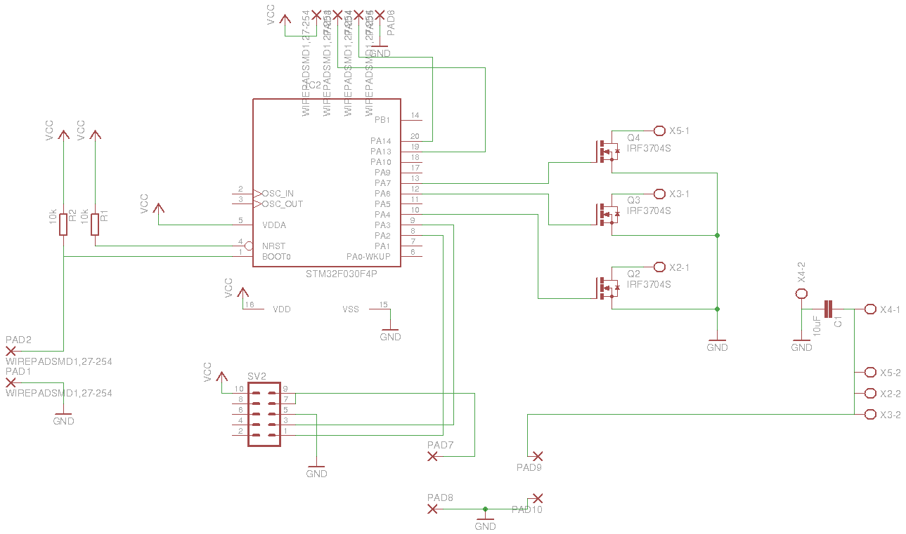
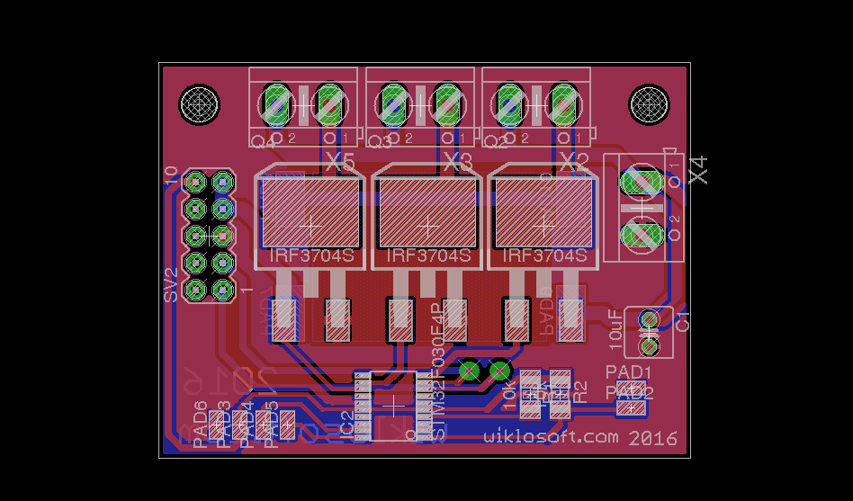
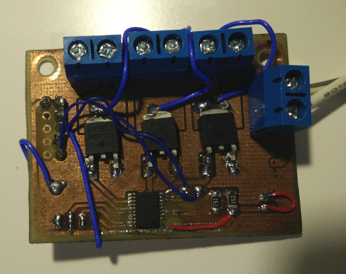
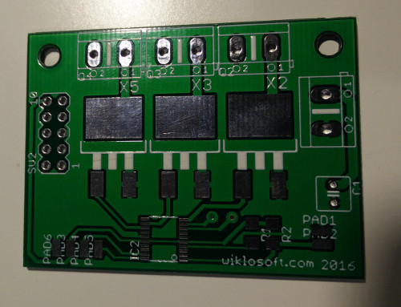
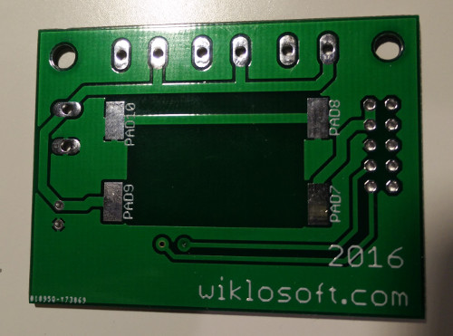

# What is it ?

Repository contains schematic + pcb for 3 channel PWM led driver (can be extended up to 6 channels). STM32F030 was used as PWM generator as it is (probably) the cheapest cortex m0 uC. 

# Why I haven't used one of dedicated chips such as WS2801 ?

I've tried but they are not as good as you may think. Their PWM frequency is to high. Cheap LED bulbs are freaking out (random blinking etc.) when you will power it with 2.5[kHz] PWM. Custom driver is much more flexible and freqency can be set to much lower value (~400Hz). Another advantage of lower frequency is driving mosfets directly from uC - no speed boosters needed. It can handle up to 60-70[W] of load per channel(no heat sink).

# Part list

- 3x IRLR7821PBF (schematic contains different part number)
- 1x STM32F030
- 2x 10k resistor
- 1x 10uF capcitor (TODO: add 100nF for uC)
- some connectors

# How to open it ?

I'm using Eeagle 7 (https://cadsoft.io/). It is good, free and what is the most important it can be installed on GNU/Linux. 

# Images
## Schematic

## PCB

## Prototype

## Manutactured PCB

## Manufactured PCB with mounted elements
TODO

# License
Apache License, Version 2.0
